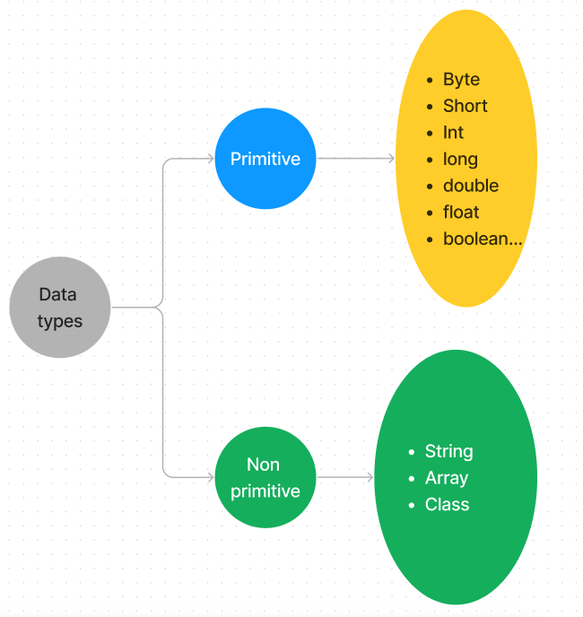
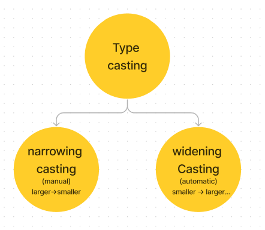
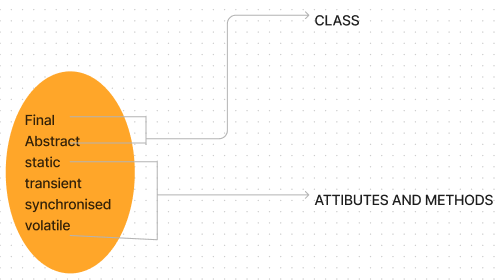
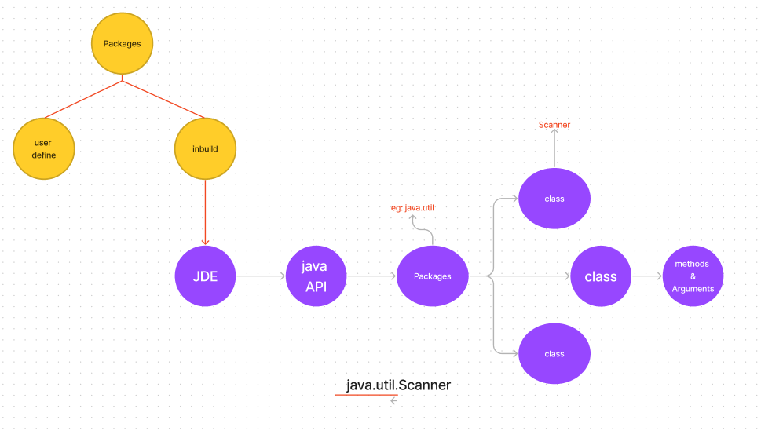

# Basic

## Myth

- file name should be same as class name
- it should be same when class is public

```java
// file name Main.java 
class ForGeeks {
 public static void main(String[] args)
 {
  System.out.println("For Geeks class");
 }
}

class GeeksTest {
 public static void main(String[] args)
 {
  System.out.println("Geeks Test class");
 }
}

```

this program will create who different classes _ForGeeks.class_ _GeeksTest.class_

## Variables & datatypes

- String
- int
- float
- boolean
- char

- final -constant read only

```java

int a,b,c;
a=b=c=1;
```




## String methods

<https://www.w3schools.com/java/java_ref_string.asp>

```java
String x = "10";
int y = 20;
System.out.println(x+y); //1020
```

## Math methods

- math methods are static

<https://www.w3schools.com/java/java_ref_math.asp>

## Method overloading

- _compile time polymorphism_ / _Static Polymorphism_/_Early binding_
- same name with:
- change in datatype of perimeter
- change in number of perimeter
- change in order of perimeter

## Static and Public

- static method/attribute can be accessed without object
- public method/attribute can be accessed with object.

## Modifier

- _access modifiers_
  - provide access level
  - classes: either public or default
  - attribute, methods :public, private, protected, default

  - default - The class is only accessible by classes in the same package
  - protected: The code is accessible in the same package and subclasses.

- _non-access modifiers_



final class - can't be inherited
abstract class - can't be used to create object , must be inherited

attribute or methods

- final: can't be modified
- static: att. & method belong to class
- abstract - attribute defined inside abstract class applied only on methods

## Encapsulation

- making attribute private

## Packages

<https://docs.oracle.com/javase/8/docs/api/>

Build In



syntax

```java
//import specific class
import package.name.Class;

//import whole package
import package.name.*;
```

example

```java

import java.util.Scanner;

class ForGeeks {
 public static void main(String[] args)
 {
  System.out.println("For Geeks class");
 }
}

class GeeksTest {
 public static void main(String[] args)
 {
  try (Scanner myObj = new Scanner(System.in)) {
   System.out.println("Enter username");

   String userName = myObj.nextLine();
   System.out.println("Username is: " + userName);
  }

 }
}
```

User Define

```java

// define your package name
package mypack;
import java.util.Scanner;

public class Basic {
    public static void main(String[] args) {
        try (Scanner obj = new Scanner(System.in)) {
            System.out.println("Enter surname");
            String surname = obj.nextLine();
            System.out.print(surname);
        }
    }
}

```

```cmd

javac .\Basic.java
javac -d . .\Basic.java
java mypack.Basic
```
