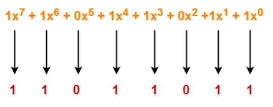

# Unit 2

- Link layer and LAN
  - Intro. to Link Layer and its services
  - where link layer is implemented?

- Error detection and correction techniques

  - Parity checks
  - Checksum
  - CRC
- Multiple Accessing Protocols
  - Channel Partitioning
  - Random Access(Slotted Aloha, Aloha , CSMA)
  - Taking Turns

- Link layer Addressing

  - MAC addressing
  - ARP
  - Ethernet
  - CSMA/CD
  - Ethernet Technologies
  - Link layer switches
  - switches vs Routers
  - VLANS

## Link Layer

- node to node delivery 
- 
### services

    - Unacknowledged Connectionless Service
    - Acknowledged Connectionless Services
    - Acknowledged connection-oriented service

<https://www.tutorialspoint.com/error-detection-and-correction-in-data-link-layer>

## Error Detection and correction in Data link Layer

uses error control techniques to ensure that frames are transmitted from source to destination with good accuracy

Errors

bits can get corrupted due to interference or network problem
and spurious(fake) data receive by destination system

### Types of Errors

found in received frames

- Single bit error - one bit corrupted
- Multiple bits error - more than one bits corrupted
- Burst error - more than one consecutive bits are corrupted.

### Error Control

error control ways :
Error detection

- checking weather error has occurred or not
- no. of error bits and the type of error does not matter
Error correction

- finding out exact number and location of corrupted bits.

for error correction and detection additional, sender needs o send additional bits
perform checks based upon redundant bits
if no error found it removes redundant bits before passing message to upper layers

### Error Detection Techniques

- parity check
- checksum
- Cyclic Redundancy check(CRC)

#### Parity check

- adding an extra bit(parity bit) to the data to make no. of 1s either even or odd parity
- while creating frame sender count no. 1s
- if no. 1s is even parity bit is 0
- if no. of 1s is odd parity bit is 1
- on receiving frame receiver count no. of 1s in it.
- if count is even frame accepted other wise rejected
- suitable for single bit error

#### Checksum

- data divided into fixed sized frames or segments
- sender add segments using 1s complement arithmetic to get the sum
- complements the sum to get the checksum and sends it along with the data frames
- if result zero , received frames are accepted otherwise rejected

#### Cycle Redundancy check(CRC)

<https://www.gatevidyalay.com/cyclic-redundancy-check-crc-error-detection/>

- detecting accidental changes in communication channel
- based on binary division
- uses `generator polynomial` available both sender and receiver side
- CRC is an algebraic polynomial represented as a bit pattern
- power of each erm gives position of bit and coefficient gives value of bit.
$$ consider CRC generator  x^7+x^6+x^4+x^3+x+1 $$   corresponding binary pattern is 11011011

